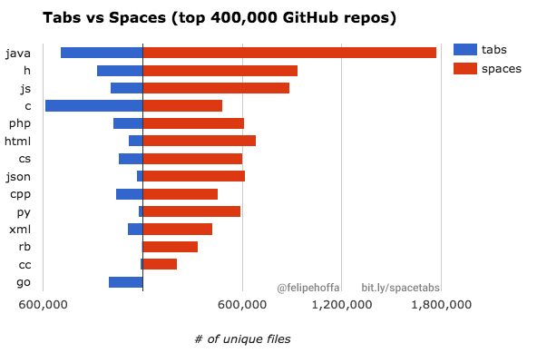

title: Go for PHP programmers
author:
    name: Evert Pot
    twitter: evertp
    url: https://evertpot.com/
output: go-for-php-progammers.html
style: evert.css
controls: true
--

# Go for PHP programmers

<div style="text-align: center; font-size: 60%; padding-top: 30px">
By Evert Pot, for GTA PHP User Group. September 2016
</div>

--

### My journey, the last 6 months

* Been very focused on PHP for most of my professional career.
* Recently wrote a blog post titled 'PHP sucks'.
* Disillusioned with php-fig.

--

### What to do next?

* The choice was between Go, Rust and Swift.
* All are very modern, have similar properties but also big differences.
* All are statically typed and compiled.

--


### I settled on Go

* Go has the least amount of features.
* Go is focussed on concurrency, multi-core, networked machines.

--

### What is Go?

* A relatively new language. Open source, but from Google.
* Brought to you by the people from C, Unix and UTF-8.
* Still up and coming.

--


--


### What is go?

* It's compiled (like C).
* It's statically typed (like Java).
* It's managed and garbage collected (like PHP/Java).
* It has great async primitives (like Erlang)
* It has a weird type system (unlike anything)

--

### Use-cases for PHP developers

* You need a real-time Websocket server that scales.
* You have a microservice or script that benefits from better performance.
* You're writing a TCP service.
* You're writing a critical component in your business logic where bugs are
  a big problem.

--

### Or you can choose Java!

* Just as good for thoses use-cases.
* But the Java ecosystem has a problem with simplicity and conciseness.
* Ignoring large frameworks is possible but counter-culture.

--

### Choosing a language means choosing a culture

* Goes beyond syntax.
* Ecosystem.
* Popular library choices.
* Coding standards.
* Application Architecture.

--

### Lets write some Go code

```go
package main

import (
	"fmt"
)

func main() {
	fmt.Println("Hello, PHPers")
}
```

--

### The Go command-line utility

* `go run helloworld.go`
* `go build`
* `go fmt helloworld.go`

--



--

### Strict typing

#### Go

```go
i := 5;
s := "6"

fmt.Printf("i + s: %v", i+s)
// Error

```

#### PHP

```php
$i = 5;
$s = "6"

echo "i + s: ", $i+$si;
// 11

```

--

### Function declarations

#### Go

```go
func addSome(a, b int) {
    fmt.Println(a+b)
}
```

#### PHP

```php
function addSome(int $a, int $b) {
    echo $a + $b, "\n";
}
```

--

### Calling that function


> ```php
> addSome(5, "6 million");
> ```

--
### Calling that function


> ```php
> addSome(5, "6 million");
> ```

#### PHP

* Prints 11, and throws notice.


--
### Calling that function


> ```php
> addSome(5, "6 million");
> ```

#### PHP

* Prints 11, and throws notice.
* Or throws an error if you're in strict mode.

--
### Calling that function


> ```php
> addSome(5, "6 million");
> ```

#### PHP

* Prints 11, and throws notice.
* Or throws an error if you're in strict mode.


#### Go

* Simply not a valid program

--

### Why is this important?

* In _dynamic type systems_ you only often find this bug once the function is
  called with the invalid value.
* In _static type systems_ these types of bugs can simply not exist.
* Static is also _faster_, because the check is done once, during compile.
* Dynamic means that the check has to be done for _every invocation_.

--

### Some more types

* int
* int32
* int64
* uint
* uint32
* uint64
* bool
* string
* rune
* float32

--

### Some more types

* []int
* []int32
* []int64
* []uint
* []uint32
* []uint64
* []bool
* []string
* []rune
* []float32

--

### Oh no, pointers

* *int
* *int32
* *int64
* *uint
* *uint32
* *uint64
* *bool
* *string
* *rune
* *float32

--

### Maps!

* map[string]int
* map[string]uint
* etc.

--

### Structs

```go
type Article struct {
    Id int
    Title string
    Published time.Time
    Body string
    Comments []Comment
}
```

* Uppercase first character means 'public'

--

### Structs

```go
type Article struct {
    Id int
    Title string
    Published time.Time
    Body string
    Comments []Comment
}
```

```go
article := Article{
    5,
    "Go for PHP programmers",
    time.Now(),
    "...",
}
```

--

### Adding methods

```go
func (a *Article) Publish() {
    a.Published = time.Now()
}
```

--

### Adding methods

```go
func (a *Article) Publish() {
    a.Published = time.Now()
}
```

#### Constructor

```go
func NewArticle() : Article {
    // Must return an Article
}
```

--

### Polymorphism

```go
type Publishable interface {
    func Publish()
}
```

--

### Polymorphism

```go
type Publishable interface {
    func Publish()
}
```

```go
func PublishThis(p Publishable) {
    p.Publish();
}
```

--

### The PHP equivalent

```php
class Article {
    public $id;
    public $title;
    public $published;
    public $body;
    function publish() {}
}

interface Publishable {
    function publish();
}

$article = new Article();
echo $article instanceof Publishable; // true!
```

--

### Real example

```go
// Adding this method satisfies the fmt.Stringer interface.
func (a Article) String() : string {
    return a.Title;
}

fmt.Printf("<h1>%v</h1>", someArticle);
```
--

### Example 2

```go
type (
    Reader interface {
        Read(p []byte) (n int, err error)
    }
    Writer interface {
         Write(p []byte) (n int, err error)
    }
    ReadWriter interface {
        Reader
        Writer
    }
}
```

--

### Loops


#### There's only one loop keyword:

```go
for i := 0; i < 10; i++ {
}

```

--

### Loops

#### While

```go
for {
    if condition {
        break;
    }
}

```

--

### Loops

#### Foreach

```go
for index, article := range articles {
}

```

--

### Concurrency

```go
func hi() {
    for i := 0; i < 3; i++ {
        fmt.Printf("Number %v, hahaha\n")
    }
}

hi()
```


--

### Concurrency

```go
func hi() {
    for i := 0; i < 3; i++ {
        fmt.Printf("Number %v, hahaha\n")
    }
}

go hi()
```


--

### Goroutines

* Like Node / Javascript co-routines.
* Kind of like a Worker.
* Works like an event loop.
* Unlike JS, can break out to multiple CPUs

--

### Goroutines

* Are cheap
* "10,000 Goroutines are normal, 100,000 not uncommon"
* Should be treated as real threads!

--

### Sharing state

```go
var hits int

func addHit() {
    hits = hits + 1
}

func main() {
    hits := 0
    addHit()
}
```

--

### Sharing state

```go
var hits int

func addHit() {
    hits = hits + 1
}

func main() {
    hits := 0;
    go addHit()
}
```

--

### Sharing state: mutexes

```go
var hits int
var mutex *sync.Mutex

func addHit() {
    mutex.Lock()
    hits = hits + 1
    mutex.Unlock()
}

func main() {
    hits := 0;
    mutex = &sync.Mutex{}
    go addHit()
}
```

--

### Sharing state: atomic 

```go
var hits int64

func addHit() {
    atomic.AddInt64(hits, 1)
}

func main() {
    hits := 0
    go addHit()
}
```

--

### Channels

```go
struct Hit {
   UserAgent string
   Address string
}

hitChannel := make(chan *Hit)
hits := 0;

go func() {
    hit <- hitChannel
    hits = hits + 1;
}()

for i:=0; i < 100; i++ {
    go func() {
        hit := &Hit{"",""}
        hitsChannel <- hit
    }()
}
```

--

### Selecting from multiple channels

```go
for {
    select {
    case value1 <- channel1:
        // do something with value 1
    case value2 <- channel2:
        // do something with value 2
    }
}
```

--

### PHP equivalents?

* `curl_multi_select`
* `socket_select`
* `stream_select`
* `mysqli_poll`

--

### Error handling

```go
dat, err := ioutil.ReadFile("file.txt")

if err != nil {
    // Handle the error
}
```
--

### Error handling

```go
dat, _ := ioutil.ReadFile("file.txt")
```

--

### Error handling

```go
dat, err := ioutil.ReadFile("file.txt")
if err != nil {
    panic(err)
}
```
--

### Error handling

```go
func ParseTextFile() (string, error) {

    dat, err := ioutil.ReadFile("file.txt")
    if err != nil {
        return nil, err
    }

    // Do something with file
    return result, nil

}
```

--

### Last tips

* When you're just starting off with Go, follow _every_ suggestion in the tutorials.
* PHP is great for quick prototyping, Go is less so.
* You're forced to be dilligent, but this can be rewarding for mission-critical applications.
* Go is simple enough for teams to pick up. Posssibly better than Node for the same use-cases.

--

### Sources

* [Google Trends](https://www.google.com/trends/explore?q=golang,nodejs)
* [Tabs vs Spaces - Felipe Hoffa](https://cdn-images-1.medium.com/max/1455/1*Aaqc9L1Hc62hBg_dpNgBKg.png)
* [Maximizing the use of interfaces in Go](http://mwholt.blogspot.ca/2014/08/maximizing-use-of-interfaces-in-go.html)
* [Go by example](https://gobyexample.com)
* [Dave Cheney's blog](http://dave.cheney.net/)
* [Evert Pot](https://evertpot.com/PHP-Sucks/)
* [Effective Go](https://golang.org/doc/effective_go.html)
